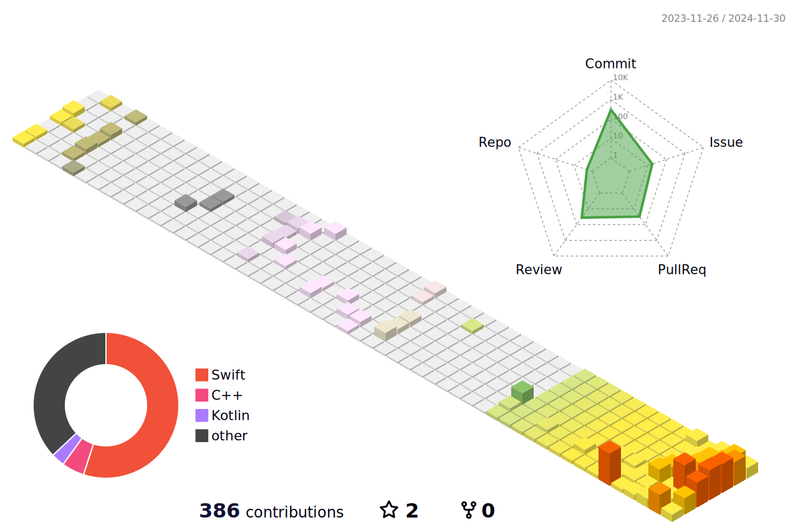

<h2> 🚀 &nbsp;I'm Studying</h2>

 
 
 

 

## ⭐️ My History
|Period|Activity|Organization|
|:-:|---|---|
|2020.03. ~ ing|COMPUTER SCIENCE & ENGINEERING|[Konkuk Univ.]([http://imc.sejong.ac.kr/](https://cse.konkuk.ac.kr/cse/9948/subview.do))|
|2023.10. ~ ing|GDG Konkuk Univ|[GDG On Campus Konkuk Univ.](https://github.com/gdsc-konkuk)|
|2024.07. ~ ing|BoostCamp(iOS)|[BoostCamp-2024](https://boostcamp.connect.or.kr/)|
|2023.08. ~ 2023.12.|42Seoul|[42 Seoul](https://42seoul.kr/seoul42/main/view)
 

<h2>✅ Problem Solving</h2>
     

 

